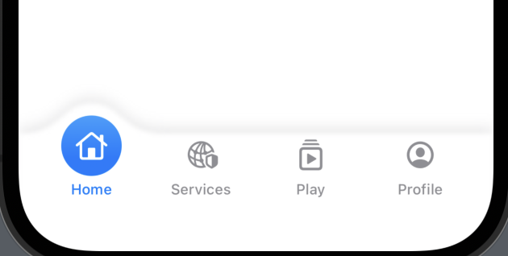

# SwiftUIPlayApp


## 1. SwiftUI App生命周期监听

```
import SwiftUI

@main
struct SwiftUIPlayApp: App {

    @Environment(\.scenePhase) var scenePhase

    var body: some Scene {
        WindowGroup {
            ContentView()
                .onChange(of: scenePhase, perform: onchage(_:))
        }
    }
}

extension SwiftUIPlayApp {
    func onchage(_ newScenePhase: ScenePhase) {
        switch scenePhase {
        case .active:
            // 当 Scene 处于前台时执行操作
            print("当 Scene 处于前台时执行操作")

        case .inactive:
            // 当 Scene 前后台切换都会时执行操作
            print("当 Scene 前后台切换都会时执行操作")

        case .background:
            // 当 Scene 转换为后台时执行操作
            print("当 Scene 转换为后台时执行操作")

        @unknown default:
            fatalError()
        }
    }
}
```

## 2. 自定义TabBar


